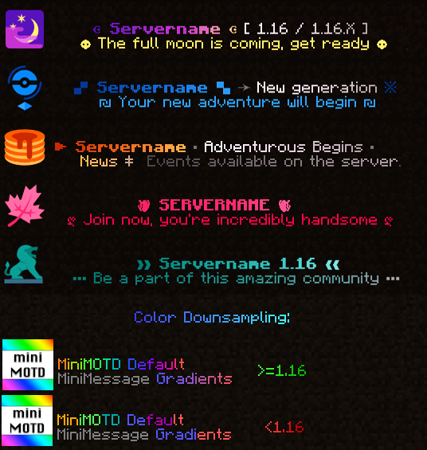

 

### MiniMOTD is a basic server list MOTD plugin/mod for Minecraft servers and proxies

- MiniMOTD supports RGB colors and gradients through [MiniMessage](https://github.com/KyoriPowered/adventure-text-minimessage), which is also where MiniMOTD gets it's name.
- For more detailed info on formatting text, refer to the [MiniMessage docs](https://docs.adventure.kyori.net/minimessage.html).
- RGB colors are automatically downsampled for outdated clients.
- RGB colors are only able to be sent by proxies and 1.16+ servers, and can only be seen by 1.16+ clients.

#### Server Platforms
- [Paper](https://papermc.io/)
- [Sponge API 8](https://www.spongepowered.org/)
- [Sponge API 7](https://www.spongepowered.org/)
- [Fabric](https://fabricmc.net/) (requires [Fabric API](https://modrinth.com/mod/fabric-api))
- [NeoForge](https://neoforged.net/)

#### Proxy Platforms
- [Velocity](https://velocitypowered.com/)
- [Waterfall](https://papermc.io/downloads#Waterfall) / Bungeecord

#### Downloads
Downloads can be obtained from any of:
 - [Modrinth](https://modrinth.com/plugin/minimotd)
 - [Hangar](https://hangar.papermc.io/jmp/MiniMOTD)
 - [GitHub releases](https://github.com/jpenilla/MiniMOTD/releases)

There is a separate jar for each platform. Waterfall and Bungeecord share the same jar.
There are two distributions for Bukkit-based servers: one for Paper >=1.21.8 only (`-paper` jar),
and one for all other supported versions (1.8.8 - 1.21.7, Spigot and Paper) (`-bukkit` jar).

#### Configuration
See the [wiki](https://github.com/jpenilla/MiniMOTD/wiki) for configuration details

#### Screenshots

